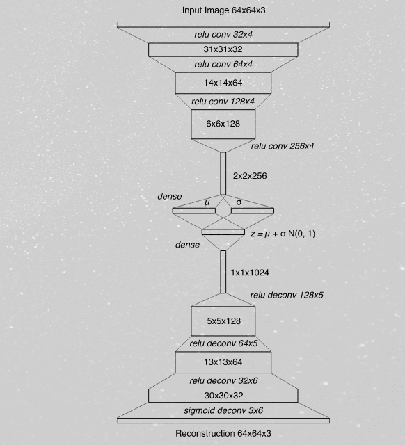
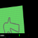
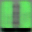
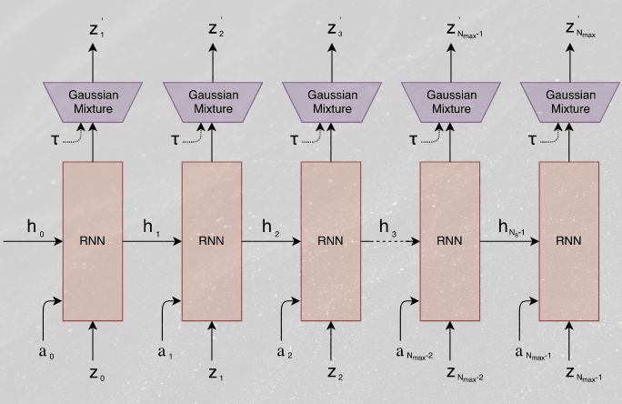

# Implementation of [World Models](https://arxiv.org/abs/1803.10122) by David Ha and Jürgen Schmidhuber.
## (With some modifications)

## Usage
```
git clone git@github.com:JussiKarkkainen/AI-notebooks.git
cd WorldModels
```
To train the models locally before running test:
```
python3 main.py --train
```
To test:
```
python3 main.py --test
```

## Implementations details
The architecture proposed in the paper consists of three models: V-model (VAE), M-model (LSTM), C-model (MLP). The implementatins of these models are described below.


### V-model (Convolutional VAE)
The CarRacing-v2 environment returns a 96x96x3 image as an observation. This is scaled down to a 64x64x3 image and fed into the VAE.
The Architecture of the VAE:

Example input image to V-model:

V-model output for previous image:

The VAE outputs a 32x1 latent vector that is used by both the M-model and the C-model.

### M-model (MDN-LSTM)
Architecture of the MDN-LSTM:



### C-model (MLP)
This is where my implementations differs from the paper. In the paper, the controller is trained using [CMA-ES](https://en.wikipedia.org/wiki/CMA-ES).
This implementations instead uses [A2C](https://paperswithcode.com/method/a2c). The model architecture is also different. The paper uses a simgle layer
linear model that maps the latent vector given by the VAE and the hidden vector of the MDN-LSTM to an action. This implementation uses a MLP with one hidden layer.
Due to CarRacing-v2 having a continuos action space (-1 to 1 for steering, 0 to 1 for gas and 0 to 1 for brake) the MLP outputs the mean and variance of the actions
as wells as the value if the state. (The critic in A2C).


### Other resources:
- [worldmodels.github.io](https://worldmodels.github.io/)
